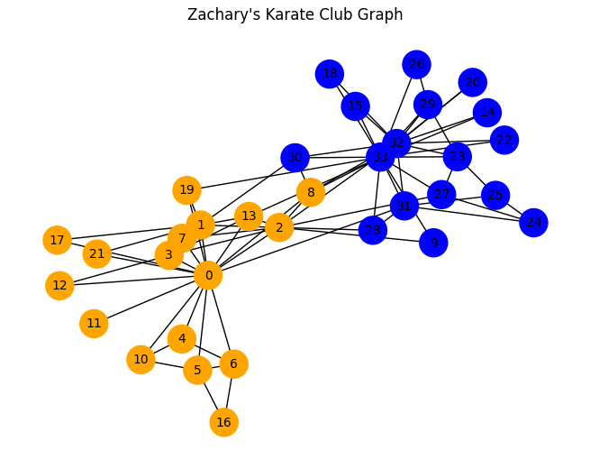
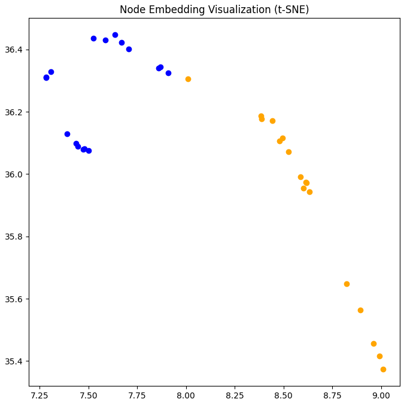
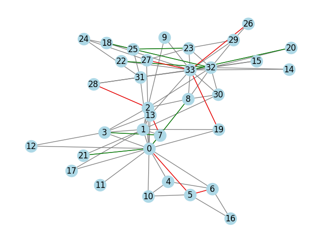
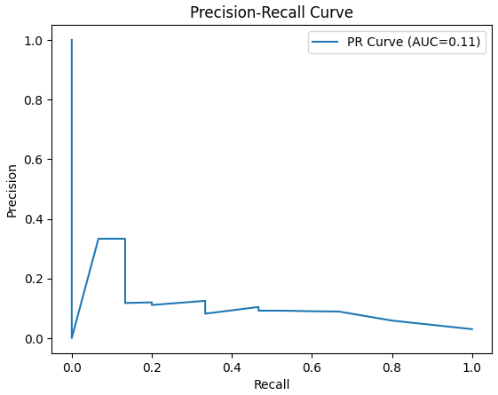

# Zachary's Karate Club Graph Analysis

## 📚 Course Information
This project was completed as part of a **Data Mining** course assignment, focusing on **graph data processing** and analysis techniques.

## 📊 Dataset
The project uses the **Zachary's Karate Club** dataset, a classic social network graph:
- **34 nodes** (club members)
- **78 edges** (social interactions)
- **2 ground truth labels** (club split into "Mr. Hi" and "John A" groups)

## 🛠️ Algorithms Used

| Algorithm | Purpose |
|-----------|---------|
| **Node2Vec** | Generate node embeddings (2D features) |
| **K-Means** | Cluster nodes into communities (k=2) |
| **t-SNE** | Visualize high-dimensional embeddings |
| **Adamic-Adar** | Predict missing edges using common neighbors |
| **Precision-Recall** | Evaluate edge prediction performance |

## 📁 Project Structure

```
📦 karate-club-graph-analysis
├── 📓 karate_club_analysis.ipynb
├── 📂 results/
│   ├── graph_visualization.png
│   ├── tsne_clustering.png
│   ├── edge_predictions.png
│   └── precision_recall_curve.png
├── 📝 README.md
└── 📄 requirements.txt
```

## 🔍 Detailed Results

### Part 1: Graph Exploration
**What we did:** Built and visualized the graph, calculated basic metrics.

**Results:**
```
📊 Graph Statistics:
- Number of nodes: 34
- Number of edges: 78
- Average degree: 4.59
- Clustering coefficient: 0.57
```



**Analysis:** The network shows moderate clustering (0.57), indicating tightly-knit groups. Average degree of 4.59 means each member interacts with 4-5 others.

---

### Part 2: Clustering & Community Detection
**What we did:** 
- Generated Node2Vec embeddings for each node
- Applied K-Means clustering
- Visualized with t-SNE
- Calculated purity against ground truth

**Results:**
```
🎯 Clustering Purity: 97%
```


**Analysis:** Only 1 node was misclassified out of 34. Node2Vec successfully captured structural similarities that align with actual community memberships.

---

### Part 3: Edge Prediction
**What we did:**
- Removed 20% of edges for testing (16 edges)
- Used Adamic-Adar similarity to predict missing edges
- Visualized predictions (green = correct, red = missed)
- Plotted Precision-Recall curve

**Results:**




**Analysis:** Adamic-Adar effectively predicts missing connections. Nodes sharing many low-degree common neighbors are more likely to form edges. The PR curve helps select optimal thresholds based on precision/recall priorities.

---

## 📊 Summary Table

| Metric | Value |
|--------|-------|
| Nodes | 34 |
| Edges | 78 |
| Average Degree | 4.59 |
| Clustering Coefficient | 0.57 |
| Clustering Purity | **97%** |
| Test Edges | 16 (20%) |

## 💻 Quick Start

```bash
# Install dependencies
pip install networkx matplotlib node2vec scikit-learn numpy

# Run the notebook
jupyter notebook karate_club_analysis.ipynb
```

### `requirements.txt`
```
networkx==3.1
matplotlib==3.7.1
node2vec==0.4.6
scikit-learn==1.2.2
numpy==1.24.3
```
